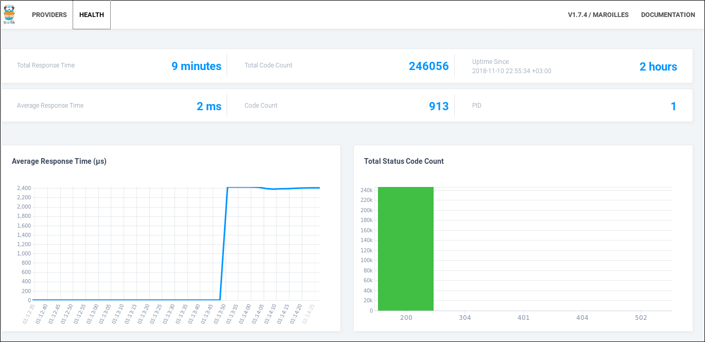
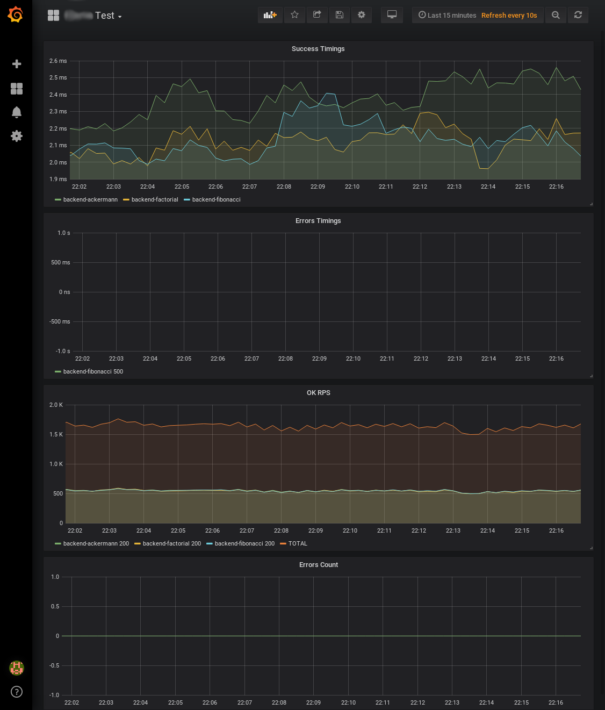
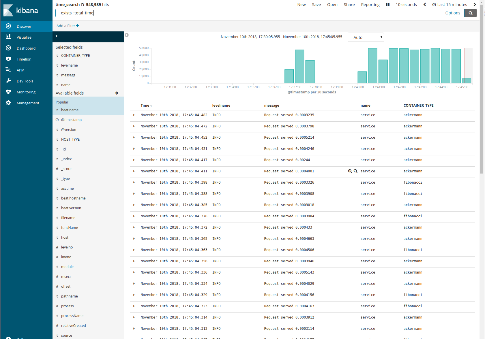
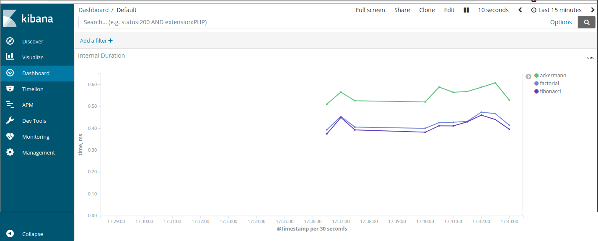

Prerequirements
===============

Haven't tested on OSes other than Linux. Maybe won't work on OSX.

`python` >= 3.6

`make` all versions should work

`docker` version should be at least 17.06

`docker-compose` version should be at least 1.13

If you will test kibana you will need to increase to at least `vm.max_map_count=262144`. You can check it's current value by running `sysctl vm.max_map_count`.

And it can be changed with

```
sudo sysctl -w vm.max_map_count=262144
```

Getting started
---------------

Just assemble and run containers with command:

```bash
make demo
# it will assemble and run containers
# and generate some traffic to APIs
```

You can check existing docker logs by running:

```
make logs
```

You can stop everything with `make kill`

You can run local version with:

```
make run_local
```

But you will lose all fun part by doing that

API
---

All API's are exposed similarly: `/{FUNCTION}/{ARG1}/[{ARG2}/]`

So urls are:

| Function  | URL                                  | Limit ARG1  | Limit ARG2  |
|-----------|--------------------------------------|-------------|-------------|
| Fibonacci | http://localhost:8000/fibonacci/10/  | 0 <=N <=400 | NA          |
| Ackermann | http://localhost:8000/ackermann/2/2/ | 0 <=M <=3   | 0 <= N <= 4 |
| Factorial | http://localhost:8000/factorial/10/  | 0 <=N <=400 | NA          |

Each function has own limits for maximal ints and will return error with status = 400 for non-valid inputs.


Tidbits
=======

Sanic
-----

[Sanic](https://github.com/huge-success/sanic) is quite simpler asyncio server with API similar to flask. Really we don't need async framework for CPU-bound task like that. But it is quite easy to do integration testing in single process by having async framework.


Black and isort
---------------
In general it is great when all code looks in the same way for each team member. That's why `gofmt` such a thing. For python, until this year there was only one quite good solution for formatting [yapf](https://github.com/google/yapf). But in this year the better alternative has arrived [black](https://github.com/ambv/black).

For this project I've been using `black` with `isort` for code formatting.

It can be used as git alias or manually. If you want to have alias just add it to `~/.gitconfig`

```
[alias]
    black = ! git diff --cached --name-only | grep -E '.py$' | xargs -n1 -I_file -- sh -c 'black _file && isort _file'
```

Also similar hook can be setted up on git or CI, so we can enforce the same codestyle by denying commits without formatting. It isn't big deal for small project but can be an issue for bigger teams.

Traefik
-------

This is project I wanted to try. It isn't something that really needed for such small task but in general it is quite interesting solution for load balancing. Also it gives us prometheus metrics for each backend (that's the main reason why we're launching each api separately) out of the box.

If you're interested in it you can check [it's dashboard](http://localhost:8080/dashboard/) or [documentation from their site](https://docs.traefik.io/).

It has it's own health status dashboard




Grafana
-------

Main dashboard is located [here](http://localhost:8000/grafana/d/GBGrul-ik/interview-test?orgId=1&refresh=10s&from=now-15m&to=now)

User/Password = admin/admin

To fill dashboard with some data you can run `make generate-traffic`

Eventially (it will require around 60 seconds first time) you should get something like:




ELK
---

Default log collecting stack. Kibana interface is located [here](http://localhost:8000/kibana/app/kibana)

Before start you need to import it's settings:

1. Goto [Management -> Kibana -> Saved Objects](http://localhost:8000/kibana/app/kibana#/management/kibana/objects?_g=())
2. Import file from this repo: `configs/kibana/export.json`

After that you can explore it's content. NB: you can generate data with `make generate-traffic`

1. [All logs](http://localhost:8000/kibana/app/kibana#/discover/4194abf0-e4eb-11e8-84f1-dd1522945c07?_g=()&_a=(columns:!(levelname,message,name,CONTAINER_TYPE),filters:!(),index:'07fd7cc0-e480-11e8-84f1-dd1522945c07',interval:auto,query:(language:lucene,query:'*'),sort:!('@timestamp',desc)))



2. [Dashboard from logs](http://localhost:8000/kibana/app/kibana#/dashboard/487deca0-e4f6-11e8-9637-7d9052bab9fe?_g=()&_a=(description:'',filters:!(),fullScreenMode:!f,options:(darkTheme:!f,hidePanelTitles:!f,useMargins:!t),panels:!((embeddableConfig:(),gridData:(h:15,i:'1',w:24,x:0,y:0),id:'915bafc0-e4ec-11e8-84f1-dd1522945c07',panelIndex:'1',type:visualization,version:'6.4.2')),query:(language:lucene,query:''),timeRestore:!f,title:Default,viewMode:view))




There are couple pre-defined searches available for errors and timings.

Note: grafana will show timings for traefix + backend and kibana will show timings for internal function call.

By doing the math we can discover `traefik's` overhead. On my PC it is showing about 2ms overhead (traefik itself, sanic response, logging).
